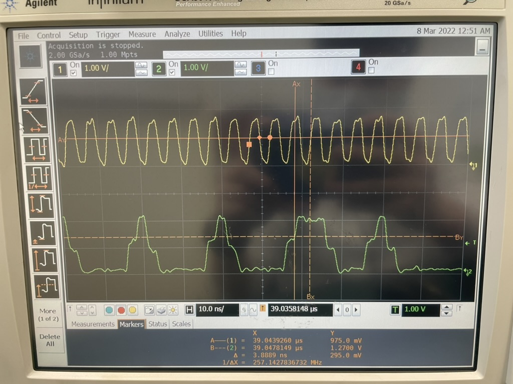

# Python Automation for Tektronix DPO4000 Oscilloscope to Measure I2C Signals

This project provides Python scripts and libraries to automate the Tektronix DPO4000 series oscilloscope for measuring and analyzing I2C signals. It allows users to set up the oscilloscope, capture I2C waveforms, and analyze data without manual interaction using Python.

## Features

- **Automatic setup** of oscilloscope for I2C signal analysis
- **Waveform capture**: Save captured I2C signal as images or CSV data
- **I2C bus analysis**: Decodes the I2C protocol from the captured signal
- **Remote control**: Communicate with DPO4000 over Ethernet, USB, or GPIB
- **Flexible configuration**: Supports various configurations for clock frequency, voltage thresholds, and capture time

## Prerequisites

Before using this project, ensure you have the following installed:

- Tektronix DPO4000 series oscilloscope
- Python 3.6+
- `pyvisa` library for controlling the oscilloscope
- `numpy`, `matplotlib` for data analysis and visualization
- Tektronix VISA (or NI VISA) installed for communication with the oscilloscope

### Installing Dependencies

Use `pip` to install the required Python packages:

```bash
pip install pyvisa numpy matplotlib
```

Ensure that your Tektronix VISA drivers are properly installed and that the oscilloscope is connected to your computer via USB, Ethernet, or GPIB.

## Setup and Usage

1. **Connecting to the Oscilloscope**: 
   Modify the connection parameters (IP address or USB resource name) in the `main.py` file. The script uses PyVISA to handle the communication.

2. **Running the Script**:
   Use the `main.py` script to initialize the oscilloscope, capture an I2C signal, and decode it:

   ```bash
   python main.py
   ```

3. **Configuring I2C Signal Measurement**:
   You can customize the measurement settings by modifying parameters such as sampling rate, voltage thresholds, and decoding configurations directly in the Python script.

4. **Viewing and Saving Data**:
   After running the script, the captured waveforms can be displayed using `matplotlib`, and data can be exported as a CSV file for further analysis.

### Example Workflow:

1. Connect the oscilloscope and your I2C device.
2. Run the Python script to automatically set up the oscilloscope for I2C decoding.
3. Capture the waveform and decode the I2C signal.
4. Analyze the signal using the built-in tools or save the data for external processing.

## File Structure

```plaintext
├── README.md             # Project description and documentation
├── main.py               # Main script to control the oscilloscope and capture I2C signals
├── utils.py              # Utility functions for signal processing
├── requirements.txt      # List of required Python packages
└── captures/             # Folder to store captured waveforms and data
```

## Example Output

Below is an example of an I2C signal captured and displayed by the script:



The decoded I2C data can be exported as a CSV file for further analysis.

## Troubleshooting

- **Connection Issues**: Ensure that the oscilloscope is properly connected and that VISA drivers are correctly installed. If using Ethernet, check the oscilloscope's IP address and verify the connection.
- **Timeout Errors**: If the script times out while communicating with the oscilloscope, try increasing the timeout settings in the `pyvisa.ResourceManager()` initialization.

## Contributing

Contributions to improve functionality or add features are welcome! Please fork this repository and submit a pull request.

## License

This project is licensed under the MIT License - see the [LICENSE](LICENSE) file for details.
